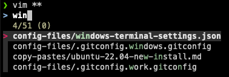

Para quem não conhece, [`fzf`](https://github.com/junegunn/fzf) é uma excelente
ferramenta de fuzzy searching (busca sem ter match exato, como o VSCode faz no
`ctrl+p` e `ctrl+shift+p`, por exemplo).

Integra muito bem com o terminal e com outras aplicações (Vim/Neovim).

Apesar de já usar `fzf` há alguns anos, recentemente descobri que ele tem
diversas funcionalidades que eu não utilizava, facilitando inclusive tarefas
simples, como alternar entre pastas.

Uma das referências que me ajudou a descobrir mais coisa foi
[esse vídeo do YouTube](https://www.youtube.com/watch?v=qgG5Jhi_Els),
recomendado no próprio repo do `fzf`.

Para quem não quiser ver o vídeo, abaixo vou listar os comandos que acho mais
úteis.

## Funcionalidades e comandos mais úteis

(Atualizado periodicamente.)

### `ctrl+t`

Permite que façamos uma busca na árvore de arquivos, começando no diretório onde
estamos atualmente (pwd). Ao selecionar um arquivo ou pasta, o caminho será
colocado na linha de comando, para ser usado em outros comandos.

### `alt+c`

Mesma ideia do `ctrl+t`, mas funciona apenas para diretórios e muda o pwd para o
que foi selecionado (ou seja, faz `cd` para o diretório).

### Usar `**<tab>` para buscar arquivos

Ao chamar um comando que aceita um arquivo como parâmetro (e.g.
`vim caminho-do-arquivo.js`), para não ter que preencher o caminho completo, o
`fzf` permite que se use `**`. Isso vai ativar a busca fuzzy por arquivos,
começando no diretório atual (pwd):

